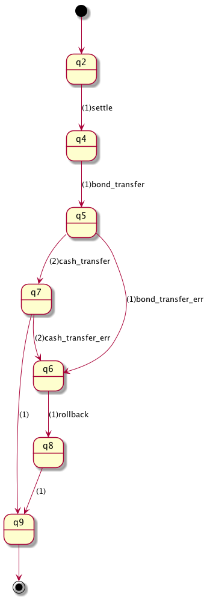

# Demo Scenario: Verification and Enforcement of DvP Smart Contract

We demonstrate how to formally verify smart contracts by our toolchain and enforcement safety (= consistency) by transpiling the contracts.

## What is DvP (Delivery versus Payment)?

A protocol in financial trade which atomically swap seller's security and buyer's cash.

## Setup

See [README](README.md).

Hereafter we assume that you checked out this repository and you're in [this](.) directory.

## Implementing DvP as a Smart Contract

### Good DvP

A Fabric chaincode in Typescript that simply implements DvP is as follows ([ts-src/ts/dvp-good.ts](ts-src/ts/dvp-good.ts)):

```typescript
export class DvP {
    bond: Bond
    cash: Cash
    seller: Party
    buyer: Party

    constructor({ bond, cash }: { bond: Bond, cash: Cash }) {
        this.bond = bond
        this.cash = cash
        this.seller = this.bond.owner
        this.buyer = this.cash.owner
    }

    // settle() executes DvP operations.
    // It automatically rollbacks when one of the transfers fails and
    // this transaction will not be recorded on peer's leader.
    settle(): boolean {
        this.bond.transfer({ newOwner: this.buyer })
        this.cash.transfer({ newOwner: this.seller })
        return true
    }
}
```

Settle() transfers a cash and a bond atomically, but they may fail.
Fabric automatically rollbacks changes made by failed transaction (that raises an exception).

### Bad DvP

But if you want to record operation result to the ledger even if it fails and
change code as follows ([ts-src/ts/dvp-bad.ts](ts-src/ts/dvp-bad.ts)):

```typescript
export class DvP {
    bond: Bond
    cash: Cash
    seller: Party
    buyer: Party

    constructor({ bond, cash }: { bond: Bond, cash: Cash }) {
        this.bond = bond
        this.cash = cash
        this.seller = this.bond.owner
        this.buyer = this.cash.owner
    }

    // settle() executes DvP operations.
    // The method returns if the operation was successful.
    // This transaction will be recorded on peer's leader
    // regardless whether it was successful or not.
    settle(): boolean {
        try {
            this.bond.transfer({ newOwner: this.buyer })
            this.cash.transfer({ newOwner: this.seller })
            return true
        } catch (e) {
            return false
        }
    }
}
```

By `try`-`catch` statement, settle() method always success and it never rollbacks.
Let us look what happens when transfer operations fail.

## State Machine Conversion

Our toolchain have formalization basis on the temporal logic, first we need to convert the contracts to state machine (or event-passing) style.

For example, the second DvP is converted to the following TS program ([ts-preprocessed/ts/dvp-bad.ts](ts-preprocessed/ts/dvp-bad.ts)):

```typescript
class DvP extends StateMachine {
    bond: Bond
    cash: Cash
    seller: Party
    buyer: Party

    constructor({ bond, cash }: { bond: Bond, cash: Cash }) {
        super()
        Object.assign(this, { bond, cash })
        this.seller = this.bond.owner
        this.buyer = this.cash.owner
    }

    main() {
        console.log(g('  TX processing starts'))
        this.raise('settle')
    }

    END() {
        console.log(g('  TX processing completed'))
    }

    settle() {
        this.raise('bond_transfer')
    }

    settle_ok() {
        console.log(g('  settlement success'))
        this.raise('END')
    }

    settle_err() {
        console.log(m('  settlement failed'))
        this.raise('rollback')
    }

    rollback_ok() {
        this.raise('END')
    }

    // bond.transfer
    bond_transfer() {
        try {
            this.bond.transfer({ newOwner: this.buyer })
            this.raise('bond_transfer_ok')
        } catch (e) {
            this.raise('bond_transfer_err')
        }
    }

    bond_transfer_ok() {
        this.raise('cash_transfer')
    }

    bond_transfer_err() {
        // this.raise('settle_err')
        this.raise('settle_ok')
    }


    // cash.transfer
    cash_transfer() {
        try {
            this.cash.transfer({ newOwner: this.seller })
            this.raise('cash_transfer_ok')
        } catch (e) {
            this.raise('cash_transfer_err')
        }
    }

    cash_transfer_ok() {
        this.raise('settle_ok')
    }

    cash_transfer_err() {
        // this.raise('settle_err')
        this.raise('settle_ok')
    }

    // rollback
    rollback() {
        console.log(m('  rollback operations'))
        this.raise('bond_rollback')
    }

    bond_rollback() {
        this.bond.rollback()
        this.raise('cash_rollback')
    }

    cash_rollback() {
        this.cash.rollback()
        this.raise('rollback_ok')
    }
}
```

Methods are event handlers. They receive an event, do some operations, and pass control flow by the `raise()` method.
The only differences of the first and second DvP are events that `bond_transfer_err` and `cash_transfer_err` raise.

Now let's run these implementations and check if it worked.
We use a simulator [ts-preprocessed/test/dvp.demo.js](ts-preprocessed/test/dvp.demo.js) that runs event passing style programs.


## Simulating Normal and Error Cases Using the Simulator Script

JS programs converted from the TS ones in the previous section is under [ts-preprocessed/js](ts-preprocessed/js), which are ran by the simulator.

### The Good DvP

First we check the Good DvP implementation in normal case.

```text
$ node ts-preprocessed/test/dvp.demo.js good

Bond owner = Bob
Cash owner = Cathy

------------------
normal operaration
------------------

processing event main...
  TX processing starts
processing event settle...
processing event bond_transfer...
  Bond transfer success
processing event bond_transfer_ok...
processing event cash_transfer...
  Cash transfer success
processing event cash_transfer_ok...
processing event settle_ok...
  settlement success
processing event END...
  TX processing completed

Bond owner = Cathy
Cash owner = Bob
```

Owner of the bond and cash is Bob and Cathy before DvP execution. In this normal case the operation were successful and owners of the assets are correctly swapped as we thought.

Then look at error case where the cash transfer fails.

```text
$ node ts-preprocessed/test/dvp.demo.js good 1

Bond owner = Bob
Cash owner = Cathy

------------------
error  operaration
------------------

processing event main...
  TX processing starts
processing event settle...
processing event bond_transfer...
  Bond transfer success
processing event bond_transfer_ok...
processing event cash_transfer...
  Cash transfer failed!
processing event cash_transfer_err...
processing event settle_err...
  settlement failed
processing event rollback...
  rollback operations
processing event bond_rollback...
processing event cash_rollback...
processing event rollback_ok...
processing event END...
  TX processing completed

Bond owner = Bob
Cash owner = Cathy
```

In this case, the contract rollbacked as shown and owners are not changed as the last two lines show.

### The Bad DvP

Let's try with the second DvP contract.
In normal case, it works well as the good one (output omitted).

But in an error case, bad thing happens:

```text
$ node ts-preprocessed/test/dvp.demo.js bad 1

Bond owner = Bob
Cash owner = Cathy

------------------
error  operaration
------------------

processing event main...
  TX processing starts
processing event settle...
processing event bond_transfer...
  Bond transfer success
processing event bond_transfer_ok...
processing event cash_transfer...
  Cash transfer failed!
processing event cash_transfer_err...
processing event settle_ok...
  settlement success
processing event END...
  TX processing completed

Bond owner = Cathy
Cash owner = Cathy
```

Rollback does not happen and both assets belong to Cathy, which breaks atomicity of the DvP.
How our toolchain detects such kind of bugs?

## Protocol specification of DvP using temporal logic

First we need to write a specification of the DvP protocol ([spec/dvp3.spec](spec/dvp3.spec)), which is based on temporal logic.
The specification consists of two sections; `protocol` and `property`.

### Protocol section

Here the `protocol` section defines a valid sequence of incoming events:

```text
protocol
    settle;
    bond_transfer;
    (
        (bond_transfer_err; rollback) +
        cash_transfer; (cash_transfer_err; rollback)?
    )
;;
```

The notation is similar to regular expressions; each word denotes an event name, `ev1; ev2` expresses that an event `ev2` immediately follows an event `ev1`, `ev1 + ev2` means that either `ev1` or `ev2` should occur, `ev?` requires `ev` can occur at most once.

Unfolding the expression makes understand the expression easier.
All the following sequences are valid by the spec above:

```text
settle; bond_transfer; bond_transfer_err; rollback
settle; bond_transfer; cash_transfer
settle; bond_transfer; cash_transfer; cash_transfer_err; rollback
```

Here we specified that **rollback operation should follow after failed operations.**

### Property section

*(Description about the `property` section is omitted.)*

Theoretically we can construct a state machine (state transition) that satisfies the protocol and property, where detail are beyond of the document's scope.


## Verification and Transpilation of Contracts

Our transpiler `safeguard` decorates the contract codes based on the specification file.
Let's transpile it (here we run the tool in the `dsl4sc-dev` Docker container):

```bash
$ make run-safeguard
docker run -it -v "`pwd`:/root/dvp" --rm ldltools/dsl4sc-dev bash -c ". .profile && cd /root/dvp && make -B"
rules2scxml  --exit=END dvp3.spec -o dvp3.scxml
safeguard ts-preprocessed/ts/dvp-bad.ts --js-class=DvP --js-keep-decorators --js-decorators=initial,transitions --js-decorators-lib=./decorator --spec dvp3.scxml -o ts-enforced/ts/dvp-bad.ts
safeguard ts-preprocessed/ts/dvp-good.ts --js-class=DvP --js-keep-decorators --js-decorators=initial,transitions --js-decorators-lib=./decorator --spec dvp3.scxml -o ts-enforced/ts/dvp-good.ts
```

Safeguard generates a state machine for the specification as follows:



Then it adds Typescript (or JavaScript) decorators `@intial` and `@transitions` based on the state machine.
The decorated contract is as follows ([ts-enforced/ts/dvp-bad.ts](ts-enforced/ts/dvp-bad.ts)):

```typescript
import { transitions, initial } from './decorator';

@initial("q2")
class DvP extends StateMachine {
  ...

  main() {
    console.log(g('  TX processing starts'));
    this.raise('settle');
  }

  @transitions({
    "q10": "q7",
    "q6": "q7",
    "q5": "q7"
  })
  END() {
    console.log(g('  TX processing completed'));
  }

  @transitions({
    "q2": "q4"
  })
  settle() {
    this.raise('bond_transfer');
  }

  ...
```

Transpilation adds new internal variable for state.
`@initial` defines the contract's initial state.
`@transitions` defines the constraint (pre- and post-conditions) for the state to enforce the correctness of the contract.

## Enforced Execution of Transpiled Contract

Now we can enforce contract execution by runtime checking of the contract state.
Convert the Typescript contract to JavaScript one and execute with the error case described befor:

```text
$ cd ts-enforced
$ npm run build
$ node test/dvp.demo.js bad 1

Bond owner = Bob
Cash owner = Cathy

------------------
error  operaration
------------------

processing event main...
  TX processing starts
processing event settle...
processing event bond_transfer...
  Bond transfer success
processing event bond_transfer_ok...
processing event cash_transfer...
  Cash transfer failed!
processing event cash_transfer_err...
processing event settle_ok...
  settlement success
processing event END...

TX abort: illegal event sequence:
  event END should not be triggered at internal state q8
```

Now the contract aborts by enforcement, which tells us its in an illegal state to execute correctly.

# Summary

Our toolchain formally verifies that behavior of smart contracts conform to the protocol specification and enfocement with code transpilation and runtime checking, without writing and running tests.
It much reduces development cost and contribute to safety and correctness of the contracts.
